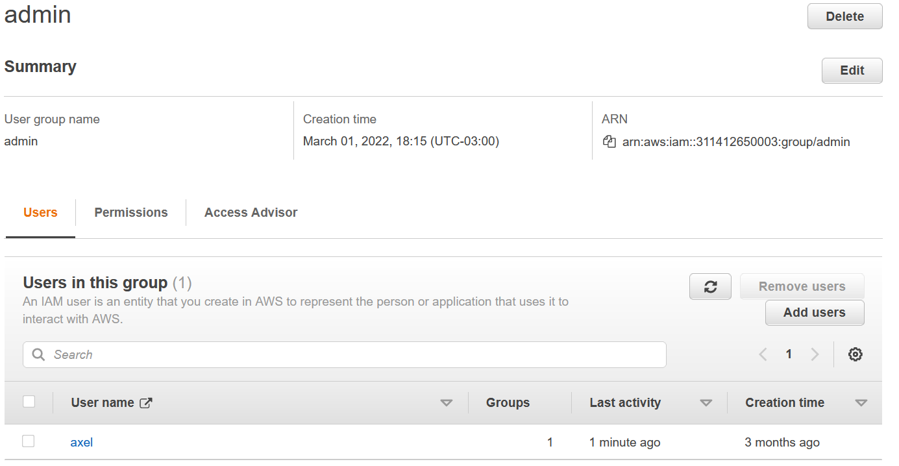
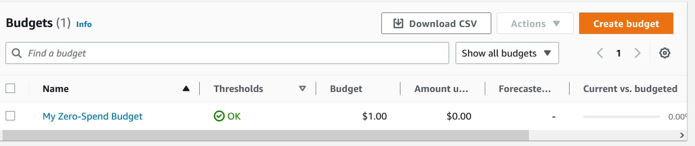
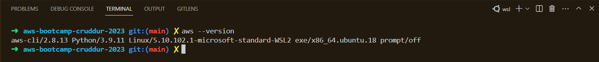
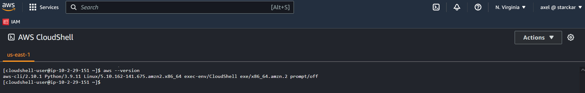
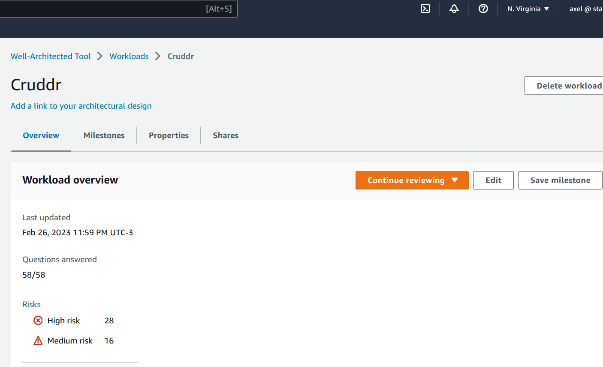

# Week 0 — Billing and Architecture

* Generated AWS Credential. Created a User Group "Admin User Group" and a User attached to that User Group.

* Set up a budget

* Set up a budget alert

* Installed local aws cli

* Used Cloudshell

* Recreated Conceptual Diagram in Lucid Charts

[Link](https://lucid.app/documents/view/4fe73521-b00b-41d3-b83f-790d7110b18c)

* Reviewed AWS Well Architected Tool

* Completed Security Quiz
* Completed Pricing Quiz
