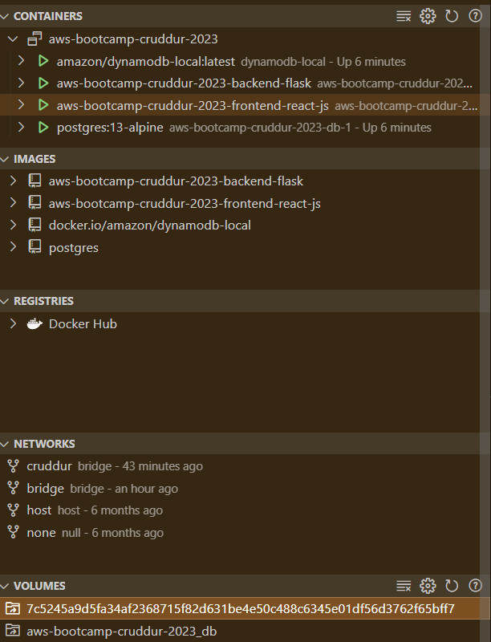

# Week 1 — App Containerization

* Contanerized Frontend, Backend and created Docker compose file

* Wrote a notifications endpoint in backend

* Wrote a notifications page in frontend

* Set up DynamoDB local and Postgres DB

